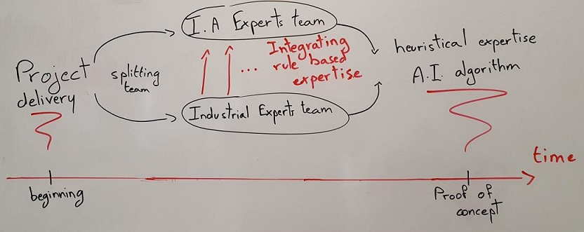
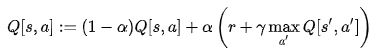
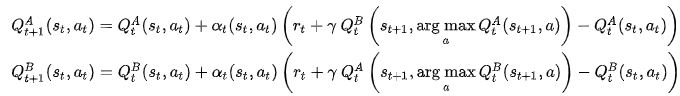
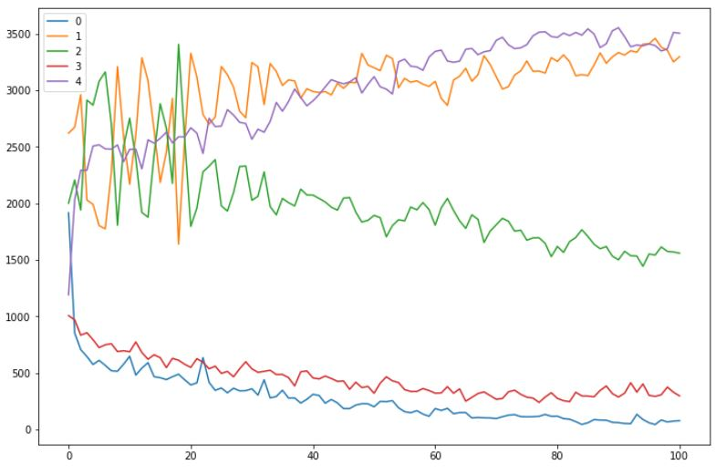

## Team and project overview 

<details open="open">
<summary><h3 style="display: inline-block">Team presentation</h2></summary>
For the Hi!Paris Data Factory, our team is composed of 7 persons following the specialized Master Big Data management and analysis at Télécom Paris. Coming from different backgrounds, our team gathers the following skills :

* Informatics
* Applied mathematics
* Project management

We split our approach to investigate two different types of algorithms : Rule Based & Reinforcement Learning through Q-learning. A first team of 4 persons were assigned to develop the Rule based algorithms by working in tandem to cover the building 1 & 2 and the building 3. The last three persons worked to develop the Q-learning algorithm and its alternatives.
On the last day of the Hi!Paris Data Factory, one person of each team was detached to work on the deliverable and gather all the source code.

The field experts team, mainly focused on understanding the necessary industrial expertise related to real life constraints. This included familiarizing with the data at hand and understanding the influence of a wide array of factors on the final cost and carbon footprint. And an AI team focused on the development of an optimal learning algorithm that integrates the industrial insights found by our experts. With Reinforcement Learning, we are able to model a real life environment and test an array of different actions to take in a given situation. 


</details>

<details open="open">
<summary><h3 style="display: inline-block">General strategy</h2></summary>

<p align="center">
  
</p>
Our goal was to create an hybrid solution Rule Based/Q-learning method by improving the naive Q-learning algorithm with technical experience.
</details>

## Scientific approach

<details open="open">
<summary><h3 style="display: inline-block">Approach description</h2></summary>

### Expertise Path : Iterations on rule based   
#### 1) Building 1&2  

We started by designing a naive algorithm, which stores electricity « freely » when the available energy exceeds the present needs (pv > load). In the opposite case (when the needs exceeds the available energy, load > pv), the energy stored in the battery is used to meet the required load levels. 
When we still have energy available after fully charging the battery, or when we still need energy after fully depleting the battery, we use the public grid, by importing or exporting electricity in order to equilibrate the energy demand and supply.

This naive algorithm gaved a medium performance, which we were able to improve by giving to a new version of this algorithm the ability to adapt to energy forecasts. In summary, when the energy demand for the coming day exceeds the energy supply (supplied by the pv installation), the microgrid imports and stores extra energy from the public grid the night before. This resulted in an improvement of the systems global performance.

#### 2) Building 3  

  To correctly approach the problem of disconnection from the grid, which happens quite often with the building 3, we used the grid_status forecasts. By looking four timesteps ahead, our algorithm is able to detect in advance a forced disconnection from the grid, and to act accordingly by fully charging its battery, importing electricity from the public grid. This allows our algorithm to avoid using the fuel generator, which is very costly : 0.9$/kWh, when accounting both for the energy bill and the associated CO2 price.

When no such disconnection from the grid is anticipated in the near future, a naive approach is used to direct the system decisions : charging the battery when excess energy is available, and discharging the battery when the energy demand is not met by the energy supply. Here also, the publi grid is used as a last resort solution, when the battery is depleted of energy before the energy demand is met.

  Optimization under constraints solution :

We also implemented an optimization under constraints solution, but the associated performances weren’t convincing enough compared to those given by the rule-based systems. The function to optimize was the sum of the costs generated over a 24 hour period, and the associated variables were the quantitites battery_charge, battery_discharge, grid_import, grid_export, pv_consumed. The many constraints associated with these variables were mainly deduced from studying the code given in the microgrid.py file.


### Reinforcement Learning Path
#### 1) Q-learning benchmark from pymgrid. Amelioration on the source code :

We firstly implemented the approach of Q-learning available on the Total R&D Github, A Q-Learning Example with PymGrid. We used this code as a benchmark and learned the theory around this method based on a model-free algorithm which tries to learn quality of actions to explain to an agent what action should be taking under a specific state.  We had to correct a little bit the source code supplied on the following points:
-	Definition of the cost function “get_cost”,
-	Update of the quality matrix (Q added to many times within the formula)  

<p align="center">
  
</p>

We saw that this method can present a significant variance and the stochastic behind the choice of the first actions can also impact the result obtain and showed the importance of tuning the hyperparameters : learning rate, discount factor and epsilon for the epsilon-greedy action choice. 

#### 2) Double Q_learning

By using the max operator inside the algorithm, some Q-values can be overestimate resulting in a poor system where some actions can be overused. We observed this behavior while trying to fit the algorithm on the building 1 environment. We saw distinctly that only two different actions were used constantly by dropping the others. The agent has a naïve approach of only buying electricity when needed.
To overcome this effect, we implemented a Double Q-learning approach, where this time, two different Q-tables are updated to minimize the weight according to an action (no overestimation occurs).

<p align="center">
  
</p>

#### 3) Hyperparameters optimisation : alpha, gamma

Hyperparameter optimization takes an importante place in the performance of a Q-learning model. 

A first hyperparameter is the learning rate alpha. It determines in what extend a new information overrides actual information. Given the seasonality of the data, we chose to use a low and decreasing learning factor so that our model doesn’t consider only the most recent information but remains accurate regardless of seasonal variations. We also implemented a variant allowing to obtain a alpha rate which varies inversely proportional to the number of time a tuplet state action has appeared.

The other hyperparameter is the discount factor. It allows the agent to learn more or less long-term strategies. We had to set it in coherence with the 

#### 4) Control Metric : reward & total cost

All along the development, we focused on the improvement of the total cost accumulated on the three buildings of the environment. We also tracked the evolution of the cumulated reward after each period on the Q-learning algorithm. The higher the cumulated reward is, the lower the total cost will be. Another interesting indicator is the number of use of each action at each step of the training phase.

<p align="center">
  
</p>


#### 5) Alternatives : SARSA - HER

We identified two alternative algorithms to the original Q-learning approche : 
- The SARSA algorithm
-  Hindsight Experience Replay [1]

The SARSA algorithm was implemented in order to compare it with the existing on overall performance, convergence or learning time.

#### 6) Use of technical expertise to improve naive Agent's actions

Technical teams could provide the good practices et manual tips to enable the creation of associated actions and to allow an augmentation of the environment space of states.

In fact, all the field-related conditions used in the rule based approach, such as off-peak hours, could be transposed in our model by adding dimensions to the discretized space and taken in account during the learning process. 


</details>

<details open="open">
<summary><h3 style="display: inline-block">Future improvements</h2></summary>

We understood the necessity of co-working with the rule based team in order to improve the first approaches of the Q-learning. As the defined environment does not imply many dimensions, we are not able to catch some specific context as precisely as can do a rule based approach. That is why, we constantly had to understand their actions implemented to be able to recreate a set of states allowing the algorithm to focus on specific aspect of the problematic.  
As explain, a major improvement would be to define more precisely the set of states and also the actions allowed to the agent.
We also had the idea of implemented another algorithm to accelerate the Q-learning by adding more heuristic information to help the model to converge towards a better solution. We studied the paper of Reinaldo A. C. Bianchi and Carlos H. C. Ribeiro, Heuristically Accelerated Q–Learning: a new approach to speed up Reinforcement Learning [2] but we didn’t have the time to code the algorithm.  
A last idea would be to explore the field of Deep learning in association with Q-learning to avoid the necessity of environment discretization and to be able to add many more states and actions in order to reach a solution that could be not intuitive.


</details>

#### References

[1] Andrychowicz M., Wolski F., Ray A., Schneider J., Fong R., Welinder P., McGrew B., Tobin J., Abbeel P., Zaremba W. (2018)  Hindsight Experience Replay
https://arxiv.org/pdf/1707.01495.pdf

[2] Bianchi R., Ribeiro C., Costa A. (2007) Accelerating autonomous learning by using heuristic selection of actions
https://link.springer.com/content/pdf/10.1007/s10732-007-9031-5.pdf

Weng B., Zhao L., Xiong H., Zhang W. (2019) Momentum-based  Accelerated  Q-learning.
https://arxiv.org/pdf/1910.11673.pdf


## Project usage
We developed a library called **grid37** that aims to optimize costs in micro-grid systems.

### Structure
- **data**: contains pickle files with buildings description
- **grid37**: the main folder of the library that contains our functions/classes used for the hackaton
- **img**: contains Readme images
- **notebook**: contains evaluation notebook
- **video**: contains the video

**Important**: the result file is name **"team37.txt"** in the root folder

### Installation

```
    pip install git+ssh://git@gitlab.repositories.hiparis.hfactory.io:team-37/group-submission.git
```

### Usage
First of all we need to load the building from the data:
```
import pickle

with open('data/building_1.pkl', 'rb') as f:
    building_1 = pickle.load(f)
```
Our library is divided into two type of algorithms:
- Rule based algorithm
- Reinforcement Q learning algorithm

We describe first how to use the **rule based library**:
```
from grid37 import Rules 

naive_algo = Rules.Naive_algo() # Select wich naive algorithm to use (default is the best)
cost = naive_algo.compute(building) # Compute the optimized cost over a year
```

The second approach is to use **Q Learning**:
```
from grid37 import DiscreteEnvironment, Reinforcement


building_environments = DiscreteEnvironment.Environment(env_config={'building':buildings})

# Q learner creation with custom parameters (a lot of parameters are available: enjoy)
learner = Reinforcement.QLearner(building_environments[0], "double")

# This method return the computed cost over a year
learner.train(horizon=-1, alpha="adaptative", gamma=0.5, nb_episode=100, plot=True)
```


